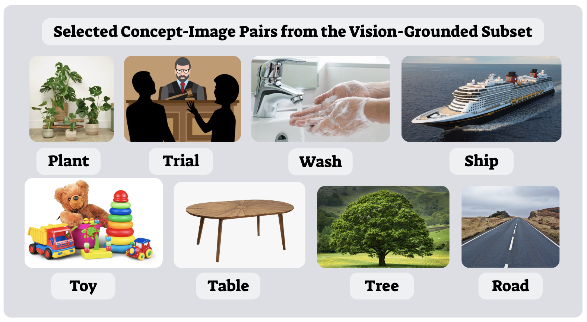
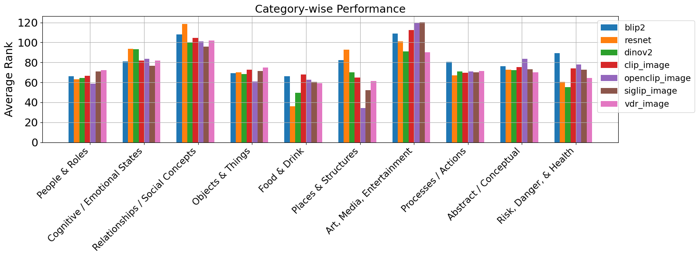

# Words, Images, and the Mind: Bridging Neural Signals with Multimodal Semantics

## Overview
This project investigates how the human brain encodes linguistic and conceptual meaning, exploring the alignment between neural activity and a diverse range of semantic embeddings — from static models (GloVe, Word2Vec) and contextual models (BERT), to multimodal vision-language models (CLIP, OpenCLIP, SigLIP, VDR, among others).

By decoding both isolated concepts and sentences from fMRI data into these embedding spaces, we aim to better understand the complementary roles of perceptual and linguistic information in modeling brain representations of meaning.

This work builds on the dataset of Pereira et al. (2018) and introduces extensive analyses incorporating image-based, text-based, and combined multimodal embeddings. The results provide insight into which semantic categories are most influenced by grounded or perceptual features.

---

## Repository Structure
- `Multimodals_analysis.ipynb`  
  Analysis of category-level decoding across static, contextual, and multimodal models.

- `Brain_Encoder_Model.ipynb`  
  Encoding analyses predicting voxelwise brain activity from different types of sentence embeddings.

- `Sentence_Decoding_and_Sentence_Representations.ipynb`  
  Sentence-level decoding comparing GloVe vs BERT representations, generalization across datasets, and topic-level performance.

- `pset_project.pdf`  
  Our final project report detailing methods, experiments, results, and discussion in the style of an ACL/CogSci paper.

---

## Highlights

### 📊 Multimodal & Vision-Language Models
We evaluated a wide suite of models:
- **CLIP / OpenCLIP / SigLIP**: Aligning image-text in shared embedding spaces.
- **VDR**: A modern multi-modal model designed to generalize across diverse inputs.
- **BLIP-2, ResNet, DINOv2**: Purely visual encoders capturing perceptual structure.

Our findings reveal that while contextual text models (BERT) modestly improve decoding, purely visual or multimodal models often capture significant neural variance — especially for perceptually grounded concepts like *Food & Drink* or *Places & Structures*.

---

### 🧠 Brain Decoding & Encoding
- **Decoding:** Predicted concept and sentence embeddings from fMRI patterns using ridge regression. Evaluated by average rank, top-k accuracy, and mean reciprocal rank.
- **Encoding:** Modeled voxelwise fMRI responses directly from sentence embeddings. BERT substantially increased the number of voxels with positive $R^2$ scores, suggesting richer contextual information better reflects neural signals.

---

### 🌱 Concept-Image Grounding
We explored how well image-based embeddings alone can predict brain activity for visually grounded concepts. Example concept-image pairs include:

---

## Key Results
| Model | Modality | Average Rank | Top-5 Accuracy | MRR |
|-------|----------|--------------|----------------|-----|
| CLIP | Image | 76.26 | 2.2% | 0.04 |
| OpenCLIP | Combo | **73.59** | **6.7%** | **0.05** |
| VDR | Combo | **67.19** | 3.9% | 0.04 |
| BERT (text) | Sentences | - | Top-5: **9%** | - |

- Combined image + text embeddings offered modest improvements over single modalities.
- Category analysis showed concrete concepts (like *Objects*, *Food*, *Places*) were more easily decoded, while abstract/social concepts (like *Relationships*, *Cognitive States*) remained challenging.

---

## 📑 Project Report
You can find the full write-up of our work in [`pset_project.pdf`](./pset_project.pdf), organized with:
- **Abstract & Introduction**
- **Detailed Experiments & Results**
- **Rich figures on concept, sentence, and category decoding**
- **Discussion on theoretical implications and future directions**

This project was completed as part of the *Language, Computation, and Cognition* course at Technion, Spring 2025.

---

## 🔗 Links
- 📄 [Project Report PDF](./pset_project.pdf)
- 📂 [Code Repository](https://github.com/shachafha/multimodal-decoding-and-the-brain)
- 📚 Original datasets: Pereira et al. (2018) [Nature Communications](https://www.nature.com/articles/s41467-018-03068-4)

---

## 🤝 Acknowledgments
This work was done by Shachaf Haviv & Shani Angel, under the instruction of Yevgeni Berzak, for the course 00960222 at Technion.

---

## 🚀 Future Directions
- Explore joint multimodal embeddings trained under explicit neural constraints.
- Integrate additional fMRI datasets (e.g., Tuckute et al., 2024) for richer analysis.
- Move beyond average pooling to architectures preserving compositional linguistic structure.
