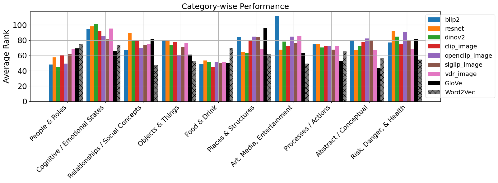
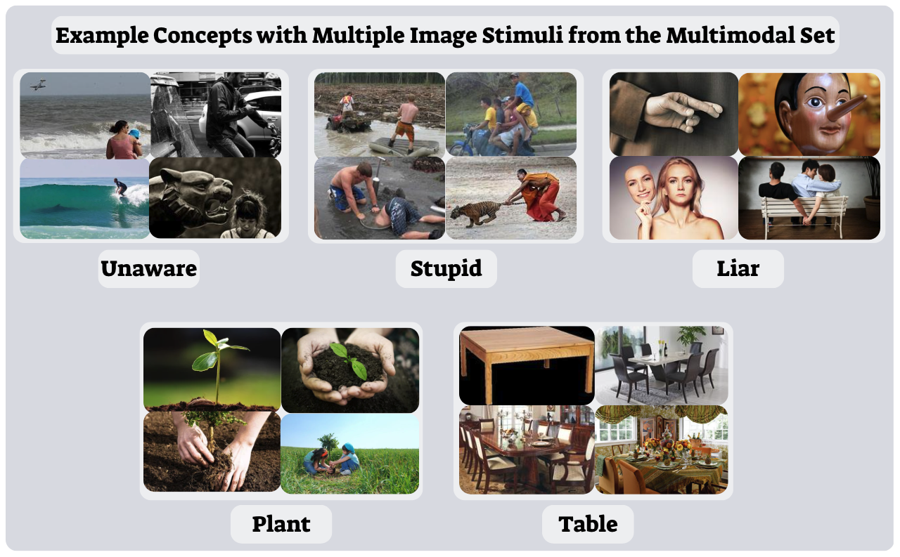

# Words, Images, and the Mind: Bridging Neural Signals with Multimodal Semantics

---

## Overview
This project investigates how the human brain encodes linguistic and conceptual meaning, exploring the alignment between neural activity and a diverse range of semantic embeddings, from static models (GloVe, Word2Vec) and contextual models (BERT), to multimodal vision-language models (CLIP, OpenCLIP, SigLIP, VDR, among others).

By decoding both isolated concepts and sentences from fMRI data into these embedding spaces, we aim to better understand the complementary roles of perceptual and linguistic information in modeling brain representations of meaning.

This work builds on the dataset of [Pereira et al. (2018)](https://www.nature.com/articles/s41467-018-03068-4) and introduces extensive analyses incorporating image-based, text-based, and combined multimodal embeddings. The results provide insight into which semantic categories are most influenced by grounded or perceptual features.

---

## Repository Structure
- `Sentence_Decoding_and_Sentence_Representations.ipynb`  
  Sentence-level decoding comparing GloVe vs BERT representations, generalization across datasets, and topic-level performance.

- `Brain_Encoder_Model.ipynb`  
  Encoding analyses predicting voxelwise brain activity from different types of sentence embeddings.
  
- `Multimodals_analysis.ipynb`  
  Analysis of category-level decoding across static, contextual, and multimodal models.

- `Project_Report.pdf`  
  Our final project report detailing methods, experiments, results, and discussion.

---

## Highlights

### 📊 Multimodal & Vision-Language Models
We evaluated a wide suite of models:
- **CLIP / OpenCLIP / SigLIP**: Aligning image-text in shared embedding spaces.
- **VDR**: A modern multi-modal model designed to generalize across diverse inputs.
- **BLIP-2, ResNet, DINOv2**: Visual encoders capturing perceptual structure.
  
GloVe and Word2Vec added as textual baselines

Category-level analysis revealed that while visual models excel in perceptually consistent domains, their effectiveness varies by category, and even strong textual baselines like GloVe and Word2Vec do not consistently outperform them.

---

### 🧠 Brain Decoding & Encoding
- **Decoding:** Predicted concept and sentence embeddings from fMRI patterns using ridge regression. Evaluated by average rank, top-k accuracy, and mean reciprocal rank.
- **Encoding:** Modeled voxelwise fMRI responses directly from sentence embeddings. BERT substantially increased the number of voxels with positive $R^2$ scores, suggesting richer contextual information better reflects neural signals.

---

### 🌱 Concept-Image Grounding
We explored how well image-based embeddings alone can predict brain activity for visually grounded concepts. Example concept-image pairs include:

---

## Key Results
| Model | Modality | Average Rank | Top-5 Accuracy | MRR |
|-------|----------|--------------|----------------|-----|
| CLIP | Image | 76.26 | 2.2% | 0.04 |
| OpenCLIP | Combo | **73.59** | **6.7%** | **0.05** |
| VDR | Combo | **67.19** | 3.9% | 0.04 |
| BERT (text) | Sentences | - | Top-5: **9%** | - |

- Combined image + text embeddings offered modest improvements over single modalities.
- Category analysis showed concrete concepts (like *Objects*, *Food*, *Places*) were more easily decoded, while abstract/social concepts (like *Relationships*, *Cognitive States*) remained challenging.

---

## 🔗 Original datasets
- The code is based on Pereira et al. (2018) data base which can be found here [Link to dataset](https://osf.io/hmgv2)

---

This project was completed as part of the *Language, Computation, and Cognition* course at Technion, Spring 2025.

